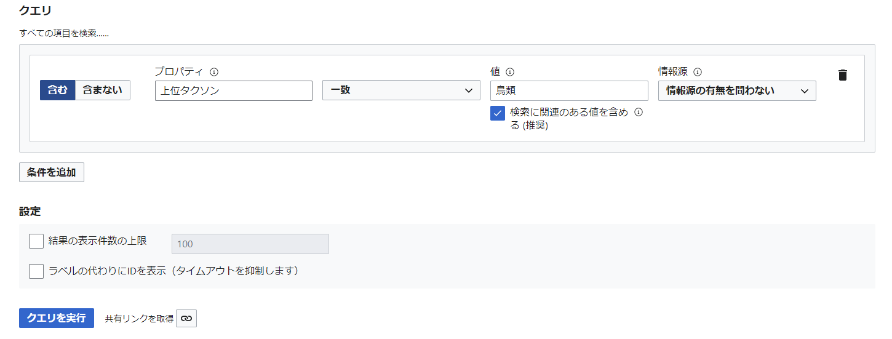

# Bird_ontology_Project

本リポジトリは，WikiDataにおいて鳥類（記事名：Bird　記事ID：Q5113）以下に属する記事を全て取得し，グラフデータとして表現するまでのコードを保管している．本リポジトリでは，WikiDataから鳥類のページを取得し，最終的にそれらの系統樹を表すエンティティパスを取得している．以下に各ディレクトリおよびコードの解説を述べる．

本データの応用先の一例として，鳥類の分類の上下関係(taxon)を把握することで鳥の種類ごとに近縁の度合いを数値化することが可能になる．これを応用して鳥類の泣き声音声データを用いた鳥類の名称判定モデルにおいて，近縁種に近い鳥類名称を判定結果とした場合に，単なる判定ミスに比べてより高いスコアを与えることができ，正確にモデルの性能を評価することが可能となる．これは，取り違えて分類した鳥同士が系統樹において近い場合と遠い場合，後者の方が誤判定としては深刻であるためである．

## query.tsv 

[Wikidataクエリサービス](https://query.wikidata.org/)にアクセスし，以下のSQLを実行することで得られるtsvファイルである．

```
SELECT DISTINCT ?item ?itemLabel WHERE {
  SERVICE wikibase:label { bd:serviceParam wikibase:language "[AUTO_LANGUAGE]". }
  {
    SELECT DISTINCT ?item WHERE {
      ?item p:P171 ?statement0.
      ?statement0 (ps:P171/(wdt:P171*)) wd:Q5113.
    }
  }
}
```
上記SQLは，[ウィキデータクエリビルダー](https://query.wikidata.org/querybuilder/?uselang=ja)において，図のように入力した場合に得られるものと同じであるが，ウィキデータクエリビルダーでは結果をtsvファイルにしてダウンロードすることができない．



query.tsvは，以下のようなWikidataのエンティティページリンクである．これらは，Q5113（Bird）をより上位の分類(taxon)に持つようなエンティティ一覧であり，スズメや燕といった鳥類の名前はもちろん，スズメ目等の鳥類の分類方法に関する記事URLが含まれる．

```
item
http://www.wikidata.org/entity/Q132731
http://www.wikidata.org/entity/Q136317
http://www.wikidata.org/entity/Q179112
http://www.wikidata.org/entity/Q182761
...(略)....
```

## notebook.ipynb
本データの作成時に用いたjupyter notebook形式のコードである．コードにおける処理については，Program_Flowchart.drawioに記入されている．

## sh1_makejson.sh
query.tsvの各行に格納されたURLの情報を取得し，各エンティティページのデータをjsonファイルに落とし込むプログラム．正確にはsh1_makejson.shの操作により得られるjsonファイルは中間生成物であるのでデータ容量の事情により既に削除済み．

notebook.ipynbにより生成されるファイルである．このファイルにはjsonこのファイルを生成するためのコマンド群が書かれている．このプロセスにより生成されたデータはprog2_maketsv.ipynbにてさらに加工される．

## data_extract/ontology.tsv
prog2_maketsv.ipynbにて生成されたtsv．各カラム名は以下の通り．

+  id：Wikidataにおけるエンティティ固有のID
+  en_name：エンティティの英語名
+  ja_name：エンティティの日本語名
+  en_aliases：英語名の別名
+  ja_aliases：日本語名の別名
+  img_urls：画像URL
+  taxon_name：エンティティが所属している階層名（例：スズメ目）
+  taxon_rank：階層レベルを表現するエンティティのID
+  taxon_rank_name：階層レベルの英語名称（例：order）
+  taxon_rank_ja_name：階層レベルの日本語名称（例：目）
+  parent_taxon：一段階上位の階層を表現するID
+  parent_taxon_name：一段階上位の階層の英語名称
+  parent_taxon_ja_name：一段階上位の階層の日本語名称
+  path：最上位階層（Q5113）から現在のIDに至るまでの順路情報

## data_external/BirdJPBookDB__data.tsv
日本野鳥大鑑に含まれるデータの一覧表．日本語を含む音声データタイトルとその他生態情報が以下のようなフォーマットで含まれている．
```
audio_id	path	book_id	曲名	全長	分布	季節	環境
1_01	db/日本野鳥大鑑1/01 アビ.wav	1	01 アビ	63㎝	全国	冬鳥	外洋、内湾
...(略)....
```

## data_external/BirdResearchDB_label01_32k.tsv
BirdResearchDB（一部）から取得したデータの一覧表．英語の音声データのパス付タイトルと鳥名部分の抜き出し文字列．
```
data01/mujisekka_160317_watarase_hirano.0004.wav	mujisekka
data01/kumagera_110326_tomakomai_namba.0002.wav	kumagera
...(略)....
```

## prog4_loading_sound_tsv.ipynb
上記のdata_external/BirdJPBookDB__data.tsvとBirdResearchDB_label01_32k.tsvを読込み，加工したプログラム．
行った作業は以下の通り．
1. BirdJPBookDB__data.tsvとBirdResearchDB_label01_32k.tsvについて，ひらがなの読み方データ，ローマ字の読み方データを付与
2. BirdJPBookDB__data.tsvおよびBirdResearchDB_label01_32k.tsvとontorogy.tsvを結合し，data_extract/BirdJPBookDB__data_2.tsvおよびdata_extract/BirdResearchDB_label01_32k_2.tsvを生成

## data_extract/voice_roma_path.tsv
以下のカラム名を持つ最終出力データ．romaはBirdResearchDB_label01_32k.tsv，列名は以下の通り．
+  audio_file_path
+  romaji_name
+  id
+  en_name
+  ja_name
+  path
+  ja_path_name
+  en_path_name
+  path_taxon_rank_name

## data_extract/data_extract/voice_kana_path.tsv
以下のカラム名を持つ最終出力データ．kanaはdata_external/BirdJPBookDB__data.tsv由来．列名は以下の通り．
+  audio_file_path
+  romaji_name
+  id
+  en_name
+  ja_name
+  path
+  ja_path_name
+  en_path_name
+  path_taxon_rank_name
